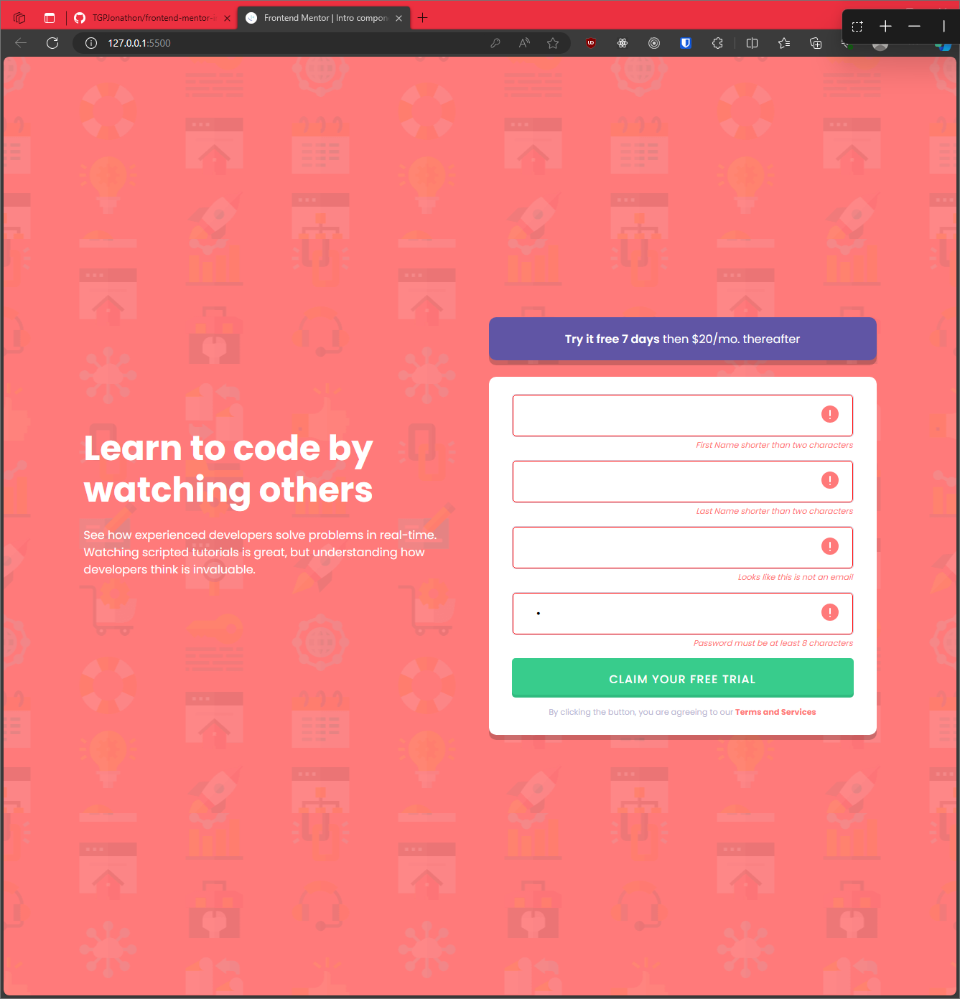

# Frontend Mentor - Intro component with sign up form solution

This is a solution to the [Intro component with sign up form challenge on Frontend Mentor](https://www.frontendmentor.io/challenges/intro-component-with-signup-form-5cf91bd49edda32581d28fd1). Frontend Mentor challenges help you improve your coding skills by building realistic projects.

## Table of contents

- [Overview](#overview)
  - [Screenshot](#screenshot)
  - [Links](#links)
- [My process](#my-process)
  - [Built with](#built-with)
  - [What I learned](#what-i-learned)
  - [Continued development](#continued-development)

## Overview

This was legitimately the longest it's ever taken me to finish one of these. I finished the design and layout in an hour, but the error states took me another two. After all my googles I decided to go with wrapping an input and span with a div, and using a bunch of CSS to style it when the input was not valid.

Since this is a newbie problem, I think I may have taken the path of most resistance but I'm honestly not sure.

### Screenshot

### Links

- Solution URL: [https://github.com/TGPJonathon/frontend-mentor-intro](https://github.com/TGPJonathon/frontend-mentor-intro)
- Live Site URL: [https://tgpjonathon.github.io/frontend-mentor-intro/](https://tgpjonathon.github.io/frontend-mentor-intro/)

## My process

### Built with

- Semantic HTML5 markup
- CSS custom properties
- Flexbox

### What I learned

I learned I didn't have a good base knowledge of how to add images to an input field. Then I learned inputs don't have content, so you have to have a parent container wrapping it and the borders from the input removed.

Normally, these take me a solid 40-50 minutes to do but the error state in the input stumped me for a bit.

### Continued development

I'm gonna watch some videos about inputs and form styling. Then continue the flexbox and grid journey.
